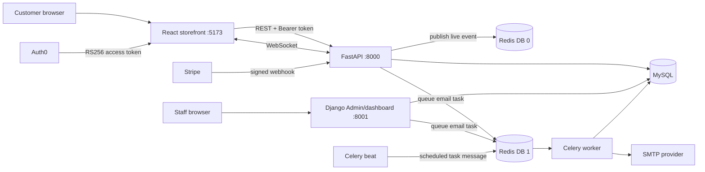
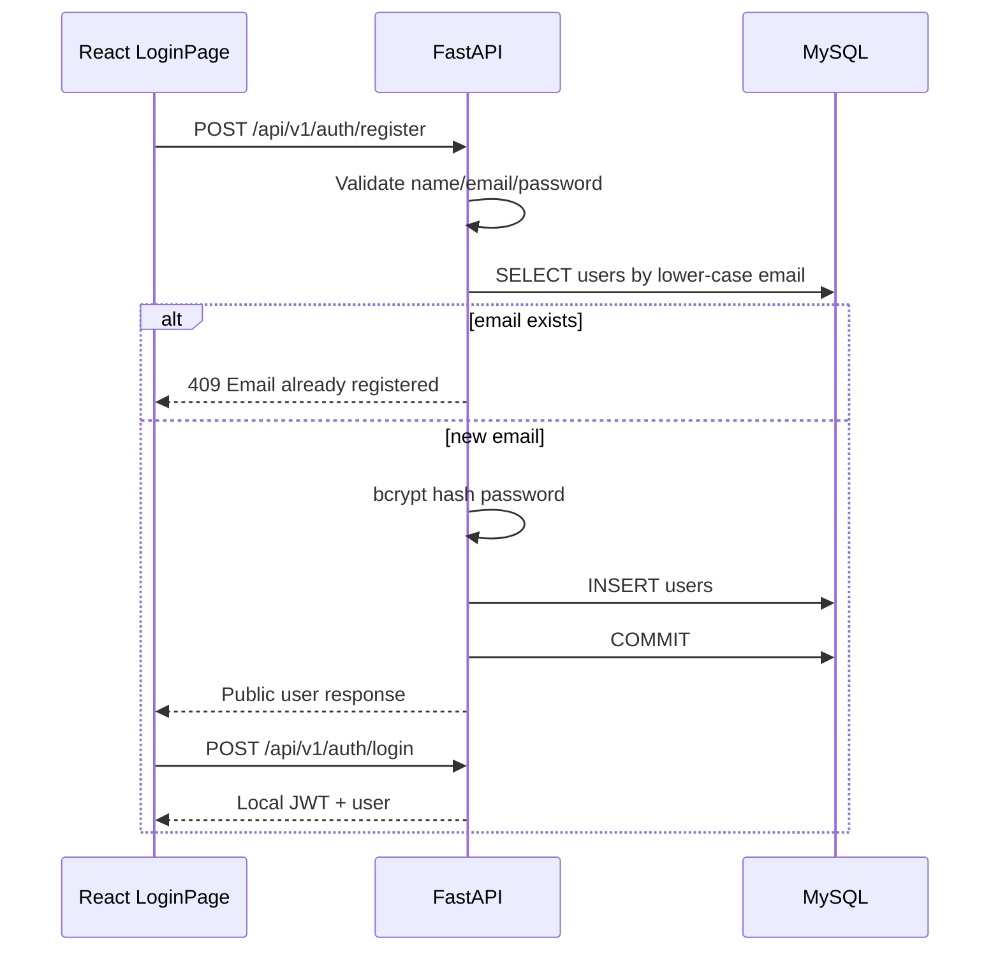
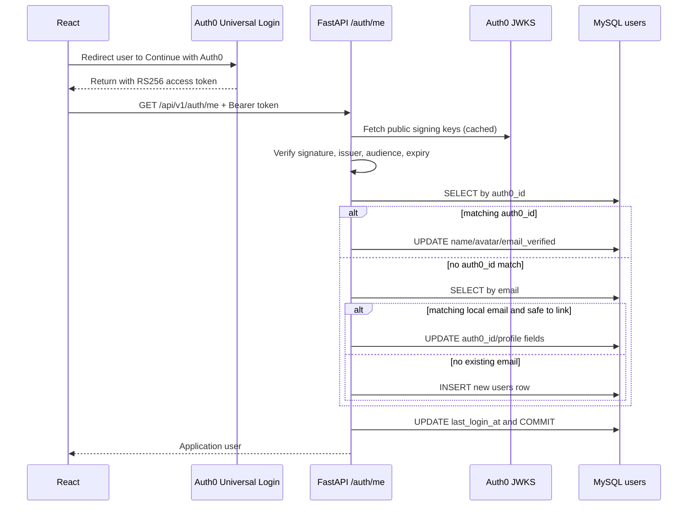
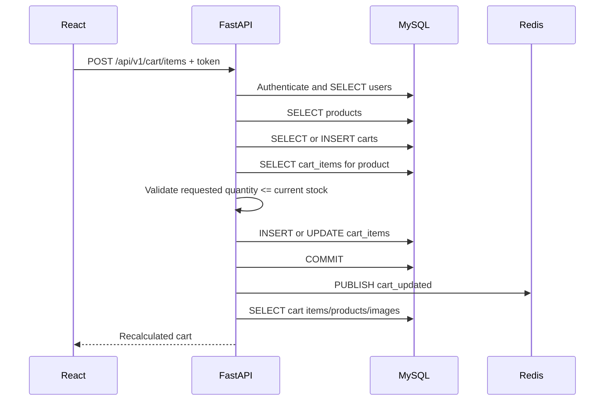
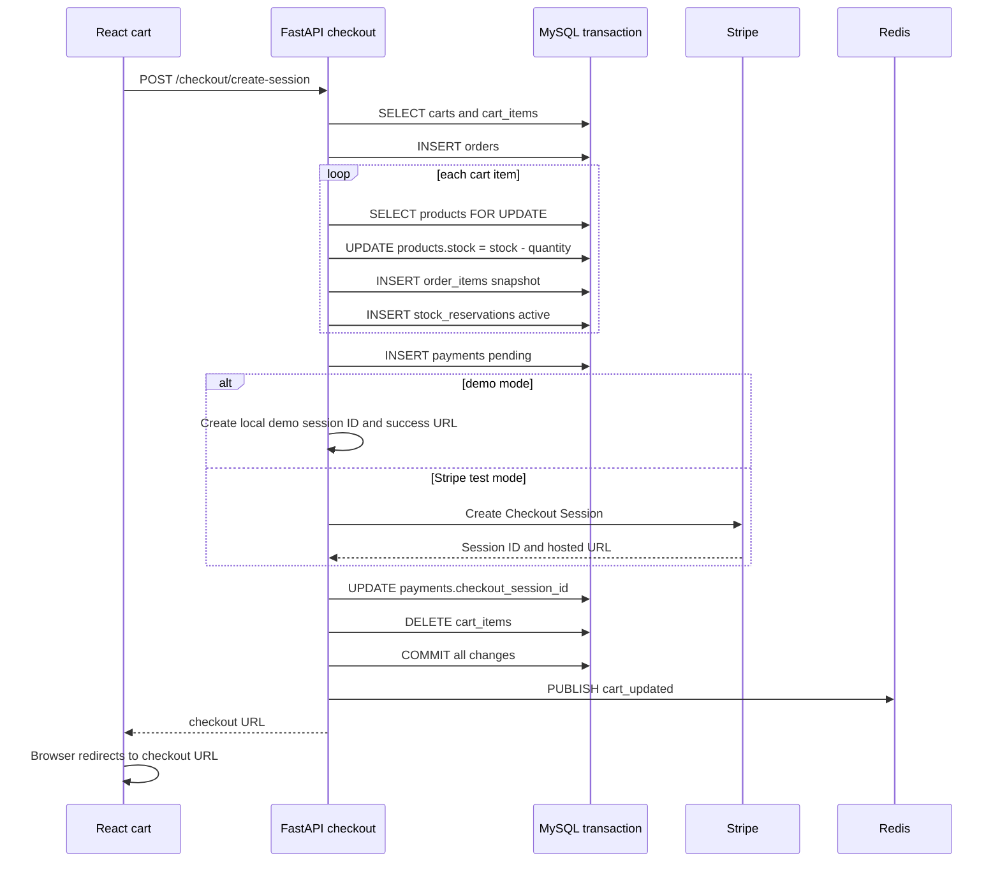
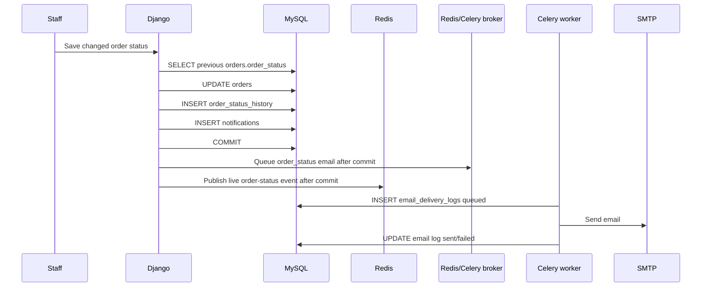
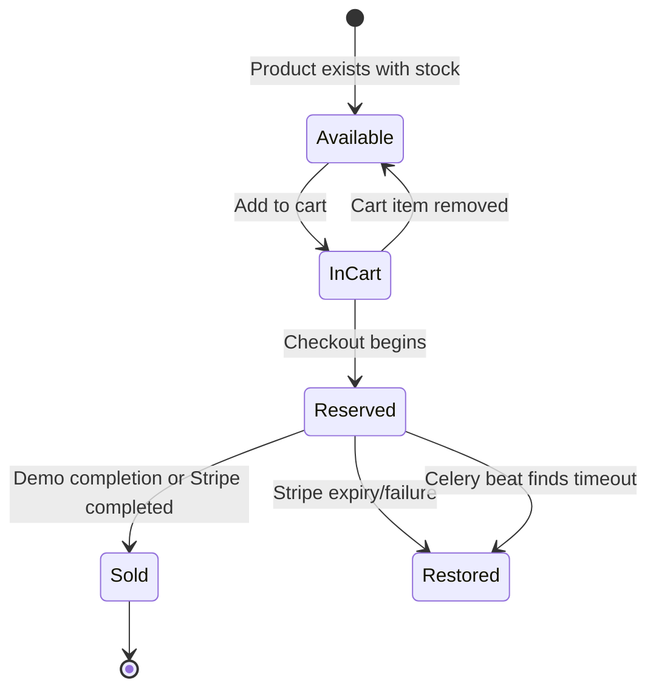
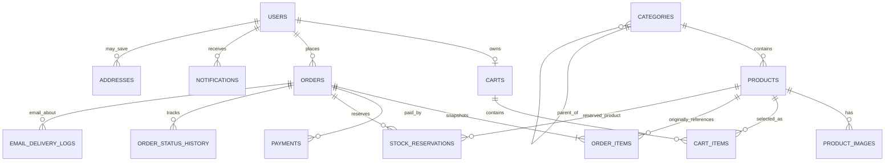

# Smart E-Commerce Application Handbook

> A beginner-friendly, code-based explanation of what the application does, where each action happens, which service is called, and which database records change.

## 1. Purpose of this handbook

This guide explains the application from the moment it starts through every important customer and administrator flow. It is written for someone learning full-stack development, so it explains both **what happens** and **why each technology is present**.

This document describes the implementation currently in this repository. It also separates:

- what is fully implemented;
- what exists in the database but is not yet connected to a user flow;
- what is performed synchronously during an HTTP request;
- what is delegated to Redis, Celery, Stripe, Auth0, or SMTP;
- what is permanent in MySQL versus temporary in Redis or the browser.

### Suggested study order

Use these groups as a table of contents:

1. **Foundation:** sections 2?6 explain the architecture, terminology, services, and startup.
2. **Authentication:** sections 7?12 explain session restoration, local login/register, Auth0, and token checks.
3. **Customer commerce:** sections 13?22 explain catalog, cart, checkout, Stripe, orders, and notifications.
4. **Administration and background work:** sections 23?33 explain Django Admin, reports, Redis, Celery, email, stock expiry, and consistency.
5. **Database and API reference:** sections 34?38 contain relationships, all tables, all APIs, and the CRUD matrix.
6. **Revision and mentor preparation:** sections 39?46 cover UI mapping, security, limitations, debugging, practice, and final summaries.

Read one group, perform its flows in the running application, and then explain that group back in your own words before moving on.

## 2. One-minute mental model

There are two user-facing web applications and several supporting services:

1. **React** displays the customer storefront in the browser.
2. **FastAPI** provides customer APIs for login, catalog, cart, checkout, orders, and notifications.
3. **Django** owns the database schema, staff administration, dashboard, reports, and background task definitions.
4. **MySQL** permanently stores users, products, carts, orders, payments, notifications, and other business data.
5. **Redis** temporarily transports Celery jobs and live notification messages.
6. **Celery worker** receives queued jobs and sends email through SMTP.
7. **Celery beat** schedules a stock-reservation cleanup job every minute.
8. **Stripe** hosts test checkout and sends signed webhooks to confirm or fail payments.
9. **Auth0** can authenticate users externally and return a signed access token.
10. **SMTP** is the protocol used to send actual email through providers such as Gmail.

The most important architectural fact is:

> Django and FastAPI are two backends connected to the same MySQL tables. Django owns migrations; FastAPI owns most customer workflows.

## 3. Architecture and data movement



### Permanent versus temporary information

| Location | What it contains | Permanent? |
|---|---|---|
| MySQL | Users, products, carts, orders, payments, stored notifications, webhook events, email logs | Yes |
| Redis DB 0 | Short-lived pub/sub messages for live browser updates | No |
| Redis DB 1 | Celery task queue/broker | No |
| Redis DB 2 | Celery task results | No |
| Browser local storage | Local application JWT or Auth0 SDK cache | Local to that browser |
| `media/` | Uploaded product-image files | Local filesystem data |
| Stripe | Test Checkout Session and Payment Intent | External service data |
| Auth0 | External identity and login session | External service data |

If Redis restarts, saved orders and notifications remain in MySQL. The user may miss an instant pop-up while disconnected, but the notifications page can load the stored record later.

## 4. Beginner glossary

| Term | Plain-English meaning |
|---|---|
| Frontend | The React screen running in the browser |
| Backend | Server code that applies business rules and accesses data |
| API | A URL the frontend calls to request or change data |
| REST | HTTP APIs using methods such as GET, POST, PATCH, and DELETE |
| ORM | Code objects that map to database tables; Django ORM and SQLAlchemy are used here |
| Migration | Versioned instructions that create or alter database tables |
| JWT/access token | A signed string proving who the caller is |
| Bearer token | The JWT sent in the HTTP `Authorization` header |
| Webhook | A server-to-server call initiated by Stripe, not by the browser |
| WebSocket | A long-lived browser/server connection for immediate events |
| Transaction | A group of database changes that either all commit or all roll back |
| Row lock | A database lock preventing two checkouts from changing the same stock row simultaneously |
| Redis pub/sub | Temporary publish-and-subscribe messaging for live events |
| Celery broker | Redis acting as a queue between the code that requests work and the worker that performs it |
| Celery worker | A separate process that executes queued background tasks |
| Celery beat | A scheduler that periodically sends tasks to the worker |
| SMTP | The protocol the Celery worker uses to send email |
| Idempotent | Safe to receive/repeat the same event without applying the business result twice |

## 5. Services and source-code ownership

| Service | Main files | Responsibility |
|---|---|---|
| React | `frontend/src/` | Screens, forms, route protection, API calls, token handling, WebSocket connection |
| FastAPI | `fastapi_backend/app/main.py`, `routes/` | Customer API and business workflows |
| FastAPI authentication | `utils/auth.py` | Local JWT and Auth0 token validation/user synchronization |
| FastAPI events | `services/events.py` | Redis publishing and Celery task submission |
| Django models | `django_admin/core/models.py` | Canonical table definitions and relationships |
| Django migrations | `django_admin/core/migrations/` | Executable database schema history |
| Django Admin | `django_admin/core/admin.py` | Staff CRUD screens and order-status workflow |
| Django dashboard | `django_admin/core/views.py` | Direct ORM analytics and report generation |
| Background tasks | `django_admin/core/tasks.py` | Email sending and expired reservation cleanup |
| Celery schedule | `django_admin/config/settings.py` | Runs reservation cleanup every 60 seconds |
| Service orchestration | `docker-compose.yml` | Starts MySQL, Redis, Django, FastAPI, Celery, beat, and frontend |

## 6. Application startup flow

When `docker compose up --build` runs:

1. Compose starts the MySQL container and Redis.
2. Their health checks must pass.
3. The Django container runs three commands in order:
   - `python manage.py migrate`;
   - `python manage.py seed_demo`;
   - `python manage.py runserver 0.0.0.0:8001`.
4. `migrate` reads committed Django migration files and updates the database schema.
5. `seed_demo` creates demo users, categories, and products only when missing.
6. The Celery worker starts and listens to Redis for jobs.
7. Celery beat starts and schedules `release_expired_stock` every 60 seconds.
8. FastAPI starts Uvicorn on port `8000`.
9. React/Vite starts on port `5173`.

In the current Windows MySQL configuration, application containers use `DB_HOST=host.docker.internal`. The Docker MySQL container still starts because Compose dependencies require it, but Django and FastAPI connect to Windows MySQL. FastAPI must have `DATABASE_URL` empty, or that value overrides the separate `DB_*` variables.

### What `seed_demo` writes

`django_admin/core/management/commands/seed_demo.py` uses Django ORM directly:

- Creates `admin@example.com` in `users` as a Django superuser if missing.
- Creates `customer@example.com` in `users` with a FastAPI-compatible bcrypt `password_hash` if missing.
- Creates categories in `categories` if missing.
- Creates six demo products in `products` if their SKU is missing.

It does not call FastAPI and does not use Redis or Celery.

## 7. Browser boot and session restoration

Entry point: `frontend/src/main.tsx`.

1. React creates the application root.
2. `SessionProvider` selects local, Auth0, or hybrid behavior using `VITE_AUTH_MODE`.
3. `App` creates browser routes.
4. `Layout` renders navigation and, when a user exists, starts notification loading and the WebSocket.

### Local session restoration

If `localStorage` contains `access_token`:

1. React calls `GET /api/v1/auth/me` with `Authorization: Bearer <token>`.
2. FastAPI decodes the HS256 local JWT.
3. It reads `users` using the token `sub` as the user ID.
4. It rejects a missing/inactive user.
5. It updates `users.last_login_at` and commits.
6. It returns the public user response.
7. React stores that response in memory and shows authenticated routes.

If validation fails, React removes the local token and treats the visitor as logged out.

### Protected pages

`ProtectedRoute` wraps `/cart`, `/orders`, `/notifications`, and `/checkout/success`.

- While session restoration runs, it displays a loading state.
- Without a user, it redirects to `/login` and remembers the requested path.
- After login, the user returns to that original path.

## 8. Authentication overview

The frontend and backend support three modes:

| Mode | Local form | Auth0 button | Accepted backend tokens |
|---|---:|---:|---|
| `local` | Yes | No | Local HS256 JWT |
| `hybrid` | Yes | Yes | Local HS256 JWT or Auth0 RS256 JWT |
| `auth0` | No | Yes | Auth0 RS256 JWT |

The frontend setting is `VITE_AUTH_MODE`; the FastAPI setting is `AUTH_MODE`. They should match.

## 9. Local user registration flow

UI: `/login`, ?Create an account?.



### Detailed steps

1. React sends `name`, `email`, and `password` to `POST /auth/register`.
2. Pydantic validates:
   - name length 2?150;
   - valid email format;
   - password length 8?128.
3. In pure Auth0 mode, FastAPI rejects this API because registration must happen through Auth0.
4. Email is lower-cased.
5. FastAPI checks `users.email` for duplicates.
6. Password is bcrypt-hashed into `users.password_hash`; plain text is never stored.
7. FastAPI inserts one `users` row and commits.
8. React immediately calls the local login API.

### Database effect

| Table | Operation | Details |
|---|---|---|
| `users` | SELECT, INSERT | Duplicate check, then new customer |

No cart is created at registration. The cart is created lazily when the user first accesses cart functionality.

## 10. Local login flow

UI: `/login`, ?Sign in?.

1. React calls `POST /api/v1/auth/login` with email and password.
2. FastAPI reads `users` by lower-case email.
3. It compares the password against `users.password_hash` using bcrypt.
4. It rejects invalid credentials with 401 or inactive users with 403.
5. It creates an HS256 JWT containing:
   - `sub`: user database ID;
   - `exp`: expiration time;
   - `iss`: `smart-ecommerce-local`.
6. It returns the token and user.
7. React saves the token in `localStorage` and user details in React state.
8. Future protected API calls add `Authorization: Bearer <token>`.

### Database effect

| Table | Operation | Details |
|---|---|---|
| `users` | SELECT | Find account and password hash |

The login endpoint itself does not update `last_login_at`. The next protected API call, including `/auth/me`, passes through `authenticate_token`, which updates `users.last_login_at`.

## 11. Auth0 login and first-user provisioning

This is the direct answer to an important question:

> **Auth0 login does not call the local `/auth/register` and `/auth/login` APIs.** It calls only Auth0 first, then the application calls `/auth/me` with the Auth0 token. `/auth/me` creates or links the application user automatically when needed.



### Exact Auth0 steps

1. The user clicks **Continue with Auth0**.
2. `@auth0/auth0-react` redirects the browser to Auth0 Universal Login.
3. Auth0 handles its configured connection, such as username/password or Google.
4. Auth0 redirects back to the storefront and its SDK obtains an access token.
5. `Auth0Session` calls `GET /api/v1/auth/me` with that token.
6. FastAPI sees token algorithm `RS256` in hybrid mode, or uses Auth0 validation directly in Auth0-only mode.
7. FastAPI downloads Auth0 JWKS public keys and caches them.
8. It verifies signature, configured audience, issuer, and token validity.
9. It reads namespaced claims such as:
   - `https://smart-ecommerce.local/email`;
   - `.../name` or `.../nickname`;
   - `.../picture`;
   - `.../email_verified`.
10. It requires an email claim.
11. It first searches `users.auth0_id` using Auth0 `sub`.
12. If found, it refreshes profile fields.
13. If not found, it searches by email:
    - an existing safe local user is linked by setting `auth0_id`;
    - an email already linked to a different Auth0 identity returns 409;
    - otherwise a new `users` row is inserted.
14. It commits, updates `last_login_at`, and returns the application user.

### Database effect

| Table | Operation | Details |
|---|---|---|
| `users` | SELECT, INSERT or UPDATE | Provision/link identity and refresh profile |

`avatar_url` is stored and returned by the API, but the current storefront still displays a generic user icon rather than the image.

### Why profile claims need an Auth0 Action

Auth0 access tokens do not always contain email/profile fields by default. This application expects them, usually as custom namespaced claims. Without the email claim, FastAPI returns 401 with a configuration message.

## 12. Token validation on every protected API

Every protected route depends on `get_current_user`:

1. Read Bearer token from the HTTP header.
2. Choose local or Auth0 validation based on mode/token algorithm.
3. Find/synchronize the user.
4. Confirm `users.is_active=true`.
5. Update `users.last_login_at`.
6. Commit before executing the requested route.

The WebSocket passes its token as the query parameter `?token=...` because browsers cannot easily attach an arbitrary Authorization header to the native WebSocket constructor.

## 13. Catalog browsing flow

The catalog is public; authentication is not required.

### Categories

React calls `GET /api/v1/categories` once when `CatalogPage` mounts.

FastAPI queries `categories` where `is_active=true`, sorts by name, and returns ID, name, slug, and description.

| Table | Operation |
|---|---|
| `categories` | SELECT |

### Product list, search, filters, sorting, and pagination

React turns URL query parameters into a request such as:

```text
GET /api/v1/products?q=lamp&category=home&sort=price_asc&page=1&page_size=12
```

FastAPI:

1. Joins `products` to `categories`.
2. Keeps active, non-deleted products in active categories.
3. Optionally filters by name/description/SKU search text.
4. Optionally filters category slug, minimum/maximum price, and stock.
5. Counts all matches for pagination.
6. Applies newest, price, or popularity ordering.
7. Uses offset/limit for the requested page.
8. For each returned product, queries `product_images` and prefers a primary image, then lowest sort order.
9. Prefixes a relative image path with the configured Django URL.
10. Returns items plus page, page size, total, and page count.

| Table | Operation | Purpose |
|---|---|---|
| `products` | SELECT | Product fields, price, stock, sales count |
| `categories` | SELECT/JOIN | Category name and active filtering |
| `product_images` | SELECT | Display image |

No table is changed while browsing.

### Product detail

React route `/products/:slug` calls `GET /api/v1/products/{slug}`.

FastAPI joins `products` and `categories`, rejects inactive/deleted/missing products with 404, loads the preferred image, and returns the same product shape used in the catalog.

## 14. Add-to-cart flow

A product can be added from the catalog or product-detail page.



Detailed behavior:

1. If no user is logged in, React redirects to `/login`.
2. React posts `product_id` and quantity (1?99).
3. Authentication reads/updates `users` as described earlier.
4. FastAPI reads `products` and rejects inactive/deleted/missing products.
5. It searches `carts` by user ID.
6. If there is no cart, it inserts one and commits it.
7. It searches `cart_items` for the same cart/product.
8. Existing quantity and requested quantity are added together.
9. If the total exceeds `products.stock`, FastAPI returns 409.
10. Otherwise it updates the existing row or inserts a new `cart_items` row.
11. It commits.
12. It publishes `{type: "cart_updated"}` to Redis channel `notifications:<user_id>`.
13. It recalculates the response using the latest product prices.

### Important stock rule

Adding to cart **does not reduce or reserve stock**. It only validates current availability. Stock is reduced when checkout begins.

### Database and Redis effect

| Resource | Operation |
|---|---|
| `users` | SELECT, UPDATE `last_login_at` |
| `products` | SELECT |
| `carts` | SELECT, possibly INSERT |
| `cart_items` | SELECT, INSERT or UPDATE |
| `product_images` | SELECT for response |
| Redis DB 0 | Publish temporary `cart_updated` event |

## 15. View-cart flow

React `/cart` calls `GET /api/v1/cart`.

1. FastAPI finds or creates the user?s single cart.
2. It joins `cart_items` with `products`.
3. It reads each primary image.
4. It calculates every `line_total = current product price ? quantity`.
5. It sums subtotal and total item quantity in Python.
6. It returns current stock as `available_stock` so React can disable the plus button.

The cart does not store copied prices. This means cart totals always use current values from `products.price`.

## 16. Change or remove cart item

### Change quantity

React calls `PATCH /api/v1/cart/items/{item_id}`.

1. Validate quantity 1?99.
2. Find the item only inside the authenticated user?s cart.
3. Load the linked product.
4. Reject quantity above current stock with 409.
5. Update `cart_items.quantity` and commit.
6. Publish `cart_updated` to Redis.
7. Return a recalculated cart.

### Remove item

React calls `DELETE /api/v1/cart/items/{item_id}`.

1. Find the item only inside the user?s cart.
2. Delete that `cart_items` row.
3. Commit.
4. Publish `cart_updated` to Redis.
5. Return HTTP 204 with no body.

Removing a cart item does not affect stock because cart items never reserve stock.

## 17. Begin-checkout flow

UI: the customer opens the cart, enters delivery fields, and submits.

Endpoint: `POST /api/v1/checkout/create-session`.

### Request validation

Pydantic validates recipient name, phone, address lines, city, state, postal code, country code, and optional customer note. The submitted address is stored as JSON on the order; it is **not** inserted into the `addresses` table.

### Transactional steps



Detailed steps:

1. Load the authenticated user?s `carts` row and all `cart_items`.
2. Reject an empty/missing cart with 400.
3. Create an `orders` object with:
   - generated `ORD-YYYYMMDD-XXXXXXXX` number;
   - pending payment/order statuses;
   - shipping address JSON;
   - totals initially zero.
4. Flush the order to obtain its ID without committing yet.
5. For each cart item:
   - read and row-lock the `products` record using `FOR UPDATE`;
   - confirm product is active, not deleted, and has enough stock;
   - return 409 and roll back everything if unavailable;
   - subtract quantity from `products.stock`;
   - calculate line total from the server-side price;
   - read the primary `product_images` record;
   - insert an `order_items` snapshot containing name, SKU, image, unit price, quantity, and line total;
   - insert an active `stock_reservations` row expiring in 30 minutes;
   - build Stripe line-item data.
6. Set order subtotal and total. Shipping, tax, and discounts are currently zero.
7. Insert one pending `payments` row.
8. Demo mode generates local IDs/URL; real Stripe mode calls Stripe?s API.
9. Store the Checkout Session ID in `payments.checkout_session_id`.
10. Bulk-delete all items from this cart.
11. Commit the complete database transaction.
12. Publish `cart_updated` through Redis.
13. Return order number, session ID, and redirect URL.

### Why the transaction and row lock matter

If two people try to buy the last item simultaneously, `FOR UPDATE` makes one transaction wait. The second transaction sees the updated stock and cannot oversell. If any item fails, `rollback()` reverses the pending order, stock changes, snapshots, reservations, and payment insert.

### Tables affected

| Table | Operation | Meaning |
|---|---|---|
| `carts` | SELECT | Find customer cart |
| `cart_items` | SELECT, DELETE | Read selection; empty after successful checkout creation |
| `products` | SELECT with lock, UPDATE | Validate and subtract reserved quantity |
| `product_images` | SELECT | Snapshot primary image |
| `orders` | INSERT | Pending order |
| `order_items` | INSERT | Historical product/price snapshots |
| `stock_reservations` | INSERT | 30-minute active reservation |
| `payments` | INSERT, UPDATE | Pending payment and Checkout Session ID |
| Redis DB 0 | Publish | Live cart refresh signal |

`addresses`, `inventory_transactions`, and `order_status_history` are not written by this API.

## 18. Demo payment completion flow

When `STRIPE_DEMO_MODE=true`, the checkout URL returns directly to:

```text
/checkout/success?demo=1&order=<order_number>
```

`CheckoutSuccessPage` calls `POST /api/v1/checkout/demo-complete/{order_number}` exactly once per component mount.

1. FastAPI confirms demo mode is enabled.
2. It selects and row-locks this user?s order.
3. `_mark_paid` exits without changes if already paid, making repeated callbacks safe.
4. It updates `payments`:
   - `status=succeeded`;
   - demo Payment Intent/transaction ID;
   - `paid_at=now`.
5. It updates `orders`:
   - `payment_status=paid`;
   - `order_status=confirmed`;
   - `placed_at=now`.
6. It changes active `stock_reservations.status` to `consumed`.
7. It increments `products.sales_count` by purchased quantities. Stock is not subtracted here because it was already subtracted when checkout began.
8. It inserts an unread `notifications` row.
9. It commits.
10. It publishes a live Redis notification.
11. It queues the `send_transactional_email` Celery task.
12. React shows confirmation.

### Tables affected

`orders`, `payments`, `stock_reservations`, `products`, and `notifications` are updated/inserted. Later, the email task inserts/updates `email_delivery_logs`.

## 19. Real Stripe Checkout flow

When `STRIPE_DEMO_MODE=false`:

1. FastAPI calls `stripe.checkout.Session.create` with server-generated line items.
2. Customer email, success URL, cancel URL, order ID, order number, and 30-minute expiry are supplied.
3. FastAPI saves the Stripe Checkout Session ID in `payments`.
4. React sends the browser to Stripe?s hosted page.
5. Stripe handles card entry. Card details never pass through or enter this application?s database.
6. Stripe redirects the browser to `/checkout/success?session_id=...`.
7. The success page displays that payment is waiting for Stripe confirmation.
8. Separately, Stripe calls the webhook endpoint. The webhook?not the browser redirect?is the trusted payment result.

A success-page visit by itself does not mark the order paid.

## 20. Stripe webhook flow

Endpoint: `POST /api/v1/checkout/stripe/webhook`.

The Stripe CLI or Stripe platform calls this endpoint; React does not.

### Security and idempotency

1. Read raw request bytes and `stripe-signature` header.
2. Validate them using `STRIPE_WEBHOOK_SECRET`.
3. Invalid/missing signatures return 400.
4. Read Stripe event ID.
5. Query `payment_webhook_events.provider_event_id`.
6. If already present, return `{received: true, duplicate: true}` without repeating payment/stock changes.
7. Otherwise insert the raw event record with status `received`.

### Locating the application payment

The handler reads the Stripe object?s session ID, then row-locks `payments` by `checkout_session_id`.

- If no payment matches, the webhook event becomes `ignored` and commits.
- If found, it row-locks the related `orders` row.

### `checkout.session.completed`

The shared `_mark_paid` function:

- changes payment to succeeded;
- stores Payment Intent and transaction ID;
- sets payment paid timestamp;
- marks order paid and confirmed;
- consumes active reservations;
- increments product sales counts;
- creates a stored notification.

Then the webhook event becomes `processed`, all changes commit, Redis publishes the notification, and Celery receives an order-confirmation email task.

### `checkout.session.expired` or `checkout.session.async_payment_failed`

The handler:

1. Sets `payments.status=cancelled`.
2. Sets `orders.payment_status=failed`.
3. Sets `orders.order_status=cancelled`.
4. Finds active reservations with row locks.
5. Adds every reserved quantity back to `products.stock`.
6. Changes reservations to `expired`.
7. Inserts a payment-failure `notifications` row.
8. Marks the webhook event processed.
9. Commits.
10. Publishes a live Redis notification.
11. Queues a payment-failure email task.

### Other Stripe event types

They are stored in `payment_webhook_events` with `processing_status=ignored`; no order/payment transition occurs.

### Webhook table effects summary

| Event | Main table changes |
|---|---|
| Duplicate event ID | Read only; returns immediately |
| Unknown session | Insert webhook event as ignored |
| Checkout completed | Webhook event, payment, order, reservations, product sales count, notification |
| Expired/async failed | Webhook event, payment, order, reservations, product stock, notification |
| Unhandled type | Insert webhook event as ignored |

The model supports `processing_status=failed` and `error_message`, but the current webhook code does not catch processing exceptions to persist that status. A database rollback can remove the newly inserted event if processing fails before commit.

## 21. Order-history flow

React `/orders` calls `GET /api/v1/orders`.

1. Authenticate user.
2. Query `orders` only where `user_id` matches the current user.
3. Sort newest first.
4. For each order, query `order_items`.
5. Return totals, statuses, shipping address, date, and snapshot items.

| Table | Operation |
|---|---|
| `users` | SELECT/last-login update through authentication |
| `orders` | SELECT |
| `order_items` | SELECT per order |

Historical item names/prices remain available even if the current product changes or is deleted, because `order_items` stores snapshots.

## 22. Stored and live notification flow

The application uses two related mechanisms:

1. **MySQL `notifications`** is the permanent notification inbox.
2. **Redis pub/sub + WebSocket** delivers an immediate signal/toast.

### Loading notifications

- `GET /api/v1/notifications` reads the newest 100 notification rows for the user.
- `?unread_only=true` filters `is_read=false` and is used for the header badge.

### Marking all read

`POST /api/v1/notifications/read-all` performs a bulk update:

- `is_read=true`;
- `read_at=now`;
- only for this user?s unread rows.

React reloads the list and dispatches an internal browser event so the header badge also refreshes.

### WebSocket connection

After login, `Layout`:

1. Gets the current access token.
2. Opens `ws://.../api/v1/ws/notifications?token=<token>`.
3. FastAPI authenticates it and updates `users.last_login_at`.
4. FastAPI accepts the WebSocket.
5. It subscribes to Redis channel `notifications:<user_id>`.
6. Redis messages are forwarded as WebSocket JSON.
7. If there is no message for roughly 20 seconds, FastAPI sends a heartbeat.
8. React ignores heartbeats.
9. A real event triggers notification-count/list reload.
10. Events with title/message show a five-second toast.
11. If disconnected, React retries after three seconds.

### Who creates stored notifications?

- Demo payment completion.
- Stripe completed/failed/expired webhook processing.
- Django Admin order-status change.
- Celery beat expiration cleanup.

The `cart_updated` Redis event is live-only and has no `notifications` row. That is intentional because cart changes are not part of the customer notification inbox.

### Failure behavior

Redis publishing errors are caught and ignored. Business database commits still succeed. The stored MySQL notification remains visible later even if the instant WebSocket toast is missed.

## 23. How Django Admin works in this application

Django Admin is a **server-rendered Django application**, not a React page. It does not call FastAPI.

When staff opens `/admin/`:

1. Browser sends an HTTP request to Django on port `8001`.
2. Django authentication middleware reads the `sessionid` cookie.
3. It reads `django_session` to identify the logged-in user.
4. The configured custom user model reads the user from `users`.
5. Django checks `is_staff`, `is_superuser`, groups, and permissions.
6. A `ModelAdmin` class builds a database QuerySet using Django ORM.
7. Django renders an HTML template and sends it to the browser.
8. Add/change forms submit directly back to Django.
9. Django validates, writes MySQL, and usually records the action in `django_admin_log`.

The admin interface therefore has this path:

```text
Staff browser -> Django URL/view/ModelAdmin -> Django ORM -> MySQL -> rendered HTML
```

There is no React and no FastAPI in the middle.

## 24. Django Admin login flow

1. Staff submits email/password at `/admin/login/`.
2. Django queries `users.email` because `USERNAME_FIELD="email"`.
3. Django checks the encoded value in `users.password` using Django?s password hasher.
4. It requires `is_active=true` and `is_staff=true`.
5. On success, Django creates/updates a `django_session` record and sends a session cookie.
6. Django updates `users.last_login`.
7. Subsequent admin requests use the session cookie, not the FastAPI Bearer token.

Two password columns exist for compatibility:

- `users.password`: Django?s encoded password for Django Admin.
- `users.password_hash`: bcrypt password used by FastAPI local storefront login.

The custom Django admin user form sets both when staff supplies a new local password. A user created only by FastAPI registration normally has unusable/default Django password data and is not automatically an admin user.

## 25. Django Admin menus and queries

Only four application models are registered as top-level menus: **Users, Categories, Products, and Orders**.

### Users menu

Model: `Customer`; table: `users`.

List page:

- reads `users`;
- shows name, email, role, staff/active/email verification, creation time;
- supports filtering and searching email/name/Auth0 ID.

Create/change:

- inserts or updates `users`;
- role `staff` or `admin` automatically sets `is_staff=true`;
- a superuser is forced to role `admin`;
- local password entry updates both Django `password` and FastAPI `password_hash`;
- `auth0_id`, `password_hash`, login timestamps, and record timestamps are read-only on the standard form;
- `avatar_url` can be changed, although React currently does not render it.

Django?s admin framework may also write `django_admin_log` for the action.

### Categories menu

Model: `Category`; table: `categories`.

- List reads categories and displays name, parent, active flag, updated time.
- Create inserts `categories`.
- Edit updates `categories`.
- Delete attempts to delete a category; products use `PROTECT`, so a category referenced by products cannot be deleted until those relationships are handled.
- The slug can be automatically populated from the name in the admin form.

No FastAPI call, Redis event, job, or email is involved.

### Products menu

Main model: `Product`; tables: `products`, `categories`, and inline `product_images`.

List page:

- reads `products` and related `categories` using `list_select_related`;
- computes ?Low stock? from `stock <= low_stock_threshold`;
- supports category/active/currency filters and name/SKU/description search.

Create/edit page:

- writes product fields in `products`;
- displays `product_images` as inline rows;
- accepts either an image URL or uploaded file.

Image upload path:

1. Django receives a multipart upload.
2. `default_storage.save("products/<filename>")` writes it below `MEDIA_ROOT` (`media/products/...`).
3. The URL is built as `DJANGO_URL + MEDIA_URL + saved path`.
4. Django inserts/updates `product_images.image_url`.
5. Django serves local media in development through `config/urls.py`.
6. FastAPI later reads that URL when serializing products.

Deleting a `product_images` database row does not explicitly remove the physical file in the current code.

### Orders menu

Main table: `orders`; inline read-only tables: `order_items`, `payments`, and `order_status_history`.

List page:

- reads orders and joins users with `select_related("customer")`;
- shows order number, customer, total, payment status, order status, and creation time;
- filters statuses/date and searches order number/customer email.

Order creation is disabled because orders should originate from checkout. Most commercial and customer fields are read-only. Staff can change order/payment status and customer note.

## 26. Admin order-status update flow

This is one of the few Django Admin actions that triggers multiple systems.



Exact behavior in `OrderAdmin.save_model`:

1. Before saving, query the previous `orders.order_status`.
2. Save the staff form to `orders`.
3. If and only if `order_status` changed:
   - insert `order_status_history` with old status, new status, and staff user;
   - insert an unread `notifications` record;
   - register an `on_commit` callback to queue an email;
   - register an `on_commit` callback to publish Redis live event;
   - display a success message in Django Admin.
4. `transaction.on_commit` prevents jobs/events from being sent before database success.

If staff changes only `payment_status` and not `order_status`, this extra history/notification/email flow does not run.

FastAPI payment confirmation changes order status directly but does not currently insert `order_status_history`; that history table currently represents staff status changes only.

## 27. Operations dashboard flow

URL: `/dashboard/`; protected by `staff_member_required`.

Django function `analytics_context()` reads MySQL directly:

| Dashboard value | Query source |
|---|---|
| Total revenue | Sum `orders.total` where `payment_status=paid` |
| Total orders | Count all `orders` |
| Paid orders | Count `orders` where paid |
| Customers | Count `users` where role is customer |
| Top products | Group `order_items` for paid orders by `product_name`, sum quantity/revenue, top five |
| Low stock | Active `products` where `stock <= low_stock_threshold`, first ten by stock |
| Revenue trend | Group paid `orders` by creation date, sum total and count orders, first 30 ordered dates |

Then `dashboard.html` renders cards/tables and passes arrays into Chart.js loaded from a CDN.

There is no dashboard API and no React involvement.

## 28. CSV and PDF reports

Both endpoints require staff login and query MySQL synchronously.

### `/reports/sales.csv`

1. Query all `orders`, join customer, newest first.
2. Write columns into an in-memory CSV HTTP response.
3. Browser downloads `sales-report.csv`.

### `/reports/sales.pdf`

1. Query the newest 100 orders and customers.
2. Use ReportLab to draw text into an in-memory PDF buffer.
3. Add pages as needed.
4. Browser downloads `sales-report.pdf`.

Neither report writes an export record or filesystem file. The configured `exports/` volume is not used by the current report functions.

## 29. Redis responsibilities

Redis has two separate roles.

### Role 1: live pub/sub (`REDIS_URL`, normally DB 0)

Publishers:

- FastAPI cart mutations;
- FastAPI payment completion/failure;
- Django Admin order-status change;
- Celery expiration task.

Subscriber:

- FastAPI WebSocket handler, one Redis subscription per connected customer socket.

Pub/sub is ?fire and forget.? Redis does not keep messages for later. MySQL is responsible for persistent notifications.

### Role 2: Celery infrastructure

- `CELERY_BROKER_URL`, normally Redis DB 1: queued task messages.
- `CELERY_RESULT_BACKEND`, normally Redis DB 2: task execution results/metadata.

FastAPI creates a lightweight Celery client and calls `send_task` by task name. Django calls the imported task?s `.delay()` method. The separate Celery worker consumes both.

Business requests intentionally catch Redis/Celery submission failures in several places so a temporary local messaging outage does not roll back a successful order transaction. The trade-off is that an email/live event can be missed if the queue is unavailable.

## 30. Celery email job

Task name: `core.tasks.send_transactional_email`.

It is queued after:

- demo order confirmation;
- Stripe order confirmation;
- Stripe checkout failure/expiry;
- Django Admin order-status change.

### Execution steps

1. Celery worker receives `template_name`, recipient email, and context.
2. Insert `email_delivery_logs` with status `queued`.
3. Find `orders` by context order number and link the log when possible.
4. Select subject based on template:
   - `order_confirmation`;
   - `payment_failed`;
   - `order_status`.
5. Render both text and HTML Django templates.
6. Build `EmailMultiAlternatives`.
7. Connect to the configured SMTP server and send.
8. On success, update the log to `sent`.
9. On failure, update it to `failed`, store a truncated error, and raise.
10. Celery automatically retries exceptions with backoff, maximum three retries.

### Tables affected

| Table | Operation |
|---|---|
| `orders` | SELECT by order number |
| `email_delivery_logs` | INSERT, then UPDATE sent/failed |

The task does not currently populate `email_delivery_logs.customer_id`, even though that optional column exists. Each retry starts the task again and can create another log row for the attempt.

SMTP does not update payment/order tables; it only delivers the already-decided result.

## 31. Celery beat and reservation-expiration job

Celery beat is a scheduler. It does not perform database work itself. Every 60 seconds it places `core.tasks.release_expired_stock` onto the Celery broker. A Celery worker executes it.

### Selection

The task finds IDs from `stock_reservations` where:

- `status=active`;
- `expires_at <= current time`.

### Processing each reservation

Each reservation runs inside its own `transaction.atomic()` block:

1. Row-lock and reload the reservation with product/order/customer.
2. Skip it if another flow already changed it or it is no longer expired.
3. Row-lock the product.
4. Add reserved quantity back to `products.stock`.
5. Set reservation status to `expired`.
6. Check whether the order has another active reservation.
7. If this was the order?s last active reservation:
   - set `orders.order_status=cancelled`;
   - set `orders.payment_status=failed`;
   - insert a `notifications` row saying checkout expired;
   - after commit, publish that notification through Redis.
8. Commit that reservation?s transaction.
9. Continue with the next ID.

### Tables affected

| Table | Operation |
|---|---|
| `stock_reservations` | SELECT, row-lock, UPDATE to expired |
| `products` | SELECT, row-lock, UPDATE stock |
| `orders` | SELECT, possibly UPDATE cancelled/failed |
| `notifications` | Possibly INSERT |
| Redis DB 0 | Possibly publish after commit |

The task does **not** currently queue a payment-failure email and does not insert an `inventory_transactions` row.

### Why run every minute?

Checkout reserves stock for 30 minutes. Beat?s one-minute interval means an expired reservation is normally restored within about one minute after its expiry time, depending on queue/worker availability.

## 32. Complete stock lifecycle



The database interpretation is:

- **In cart:** only `cart_items` changes; `products.stock` is unchanged.
- **Reserved:** `products.stock` is reduced and `stock_reservations.status=active`.
- **Sold:** reservation becomes `consumed`; `products.sales_count` increases.
- **Restored:** stock is added back; reservation becomes `expired`.

No flow currently uses reservation status `released`, although it is allowed by the model/schema helper.

The `inventory_transactions` table was designed for a detailed stock ledger, but current stock changes do not insert ledger rows. Therefore `products.stock` and `stock_reservations` are the active sources for stock behavior.

## 33. Failure and consistency behavior

### FastAPI database transactions

- A SQLAlchemy session begins a transaction as it performs work.
- `commit()` makes changes permanent.
- `rollback()` reverses uncommitted checkout work.
- `get_db()` closes the session after the request.

Checkout explicitly rolls back HTTP/business and unexpected errors. Cart/auth routes commit smaller changes directly.

### External calls and database boundaries

Stripe Checkout Session creation occurs before the database commit. If Stripe succeeds but the later database commit fails, an external session may exist without a committed local order state. The current code has no compensating Stripe-session cleanup.

Redis/email queue submission generally occurs after database commit and failures are swallowed, prioritizing permanent order correctness over live notification/email delivery.

### Idempotency protections

- Stripe event ID is unique in `payment_webhook_events`.
- `_mark_paid` makes already-paid completion a no-op.
- Demo page uses a React ref to avoid duplicate calls in one mounted component.
- Database uniqueness prevents duplicate cart/product and order/product reservations.
- Seed data uses `exists()`/`get_or_create()`.

## 34. Database relationship map



## 35. Application table dictionary

Django migrations are the executable schema source of truth. `database/schema.sql` is a readable snapshot and can lag migration-added Django authentication fields/tables.

### `users`

Purpose: the unified user table for customers, staff, Django administrators, local authentication, and Auth0 identities.

Important fields:

- identity: `id`, `name`, `email`, `auth0_id`, `avatar_url`;
- local storefront auth: `password_hash`;
- Django auth: `password`, `is_staff`, `is_superuser`, `last_login`, `date_joined`;
- authorization/status: `role`, `is_active`, `email_verified`;
- application login tracking: `last_login_at`;
- timestamps: `created_at`, `updated_at`.

Used by: local register/login, Auth0 provisioning, every protected API, Django Admin login/user menu, customer/order/cart relationships, dashboard customer count.

Deletion consequences: carts/notifications/addresses use cascade; orders use protection; several history/log relationships use set-null.

### `addresses`

Purpose: designed for reusable saved customer addresses.

Fields include recipient, phone, address lines, city/state/postal/country, type, default flag, and user ID.

Current status: **schema exists but no current API, React screen, or Django Admin registration uses it**. Checkout stores an address snapshot directly in `orders.shipping_address` instead.

### `categories`

Purpose: product grouping and optional parent/child hierarchy.

Used by: catalog APIs, Django Category menu, product foreign key, seed command.

`parent_id` points back to `categories`; deleting a parent sets child parent to null. Inactive categories/products are hidden by catalog listing.

### `products`

Purpose: current product catalog, price, availability, stock, and sales popularity.

Important fields: category, name, slug, SKU, description, price/currency, stock, low-stock threshold, sales count, active flag, soft-delete timestamp.

Used by: catalog, cart validation/calculation, checkout stock locking, reservation restoration, dashboard, Django Product menu.

`deleted_at` implements a soft-delete marker for storefront queries; admin may also perform ordinary model deletion, subject to foreign-key protection.

### `product_images`

Purpose: one-to-many product images with order and primary-image flag.

Used by: Django Product inline/upload, catalog/cart display, order-item image snapshot.

Deleting a product cascades its image rows. Current code does not automatically remove the corresponding physical media file.

### `carts`

Purpose: one persistent cart per user.

Used by: all cart and checkout flows. Created lazily on first cart access. Unique `user_id` enforces one cart per user.

Deleting a user cascades the cart.

### `cart_items`

Purpose: product quantities currently selected in a cart.

Used by: cart CRUD and checkout creation. Unique `(cart_id, product_id)` prevents duplicate rows for the same product; add-to-cart increases the existing quantity instead.

Rows are bulk-deleted after checkout creation succeeds. Cart deletion cascades items; product deletion is protected while referenced.

### `orders`

Purpose: permanent commercial order header.

Contains customer, order number, totals, currency, payment/order statuses, shipping/billing JSON snapshots, note, placed time, timestamps.

Used by: checkout, demo/Stripe payment transitions, order history, Django Orders menu, dashboard/reports, expiration cleanup, email-log linking.

The customer foreign key is protected so an order cannot lose its required customer.

### `order_items`

Purpose: immutable-style snapshots of purchased lines.

Stores product ID when available plus copied name, SKU, image URL, price, quantity, and line total. This protects order history from later catalog changes.

Used by: checkout insert, customer order history, Django Order inline, dashboard top-products query.

Deleting an order cascades items. Deleting a product sets `product_id` null while snapshot fields survive.

### `payments`

Purpose: local record of Stripe checkout/payment state.

Fields include order, provider, amount/currency, Checkout Session ID, Payment Intent ID, transaction ID, status, failure data, and paid time.

Used by: checkout insert, demo completion, Stripe webhook matching/updates, Django Order inline.

Checkout Session and Payment Intent IDs are unique to help prevent ambiguous matching. Order deletion is protected by the relationship.

### `stock_reservations`

Purpose: tie temporarily removed stock to an order/product until payment succeeds or expires.

Statuses: `active`, `consumed`, `released`, `expired`.

Used by: checkout insert, payment completion consumption, webhook failure restoration, Celery beat cleanup.

Unique `(order_id, product_id)` means one reservation per product per order. Order deletion cascades reservations; product deletion is protected.

### `inventory_transactions`

Purpose: designed as an auditable ledger for restocks, reservations, releases, sales, returns, and adjustments.

Current status: **the model/table exists, but current cart, checkout, admin, webhook, and Celery flows do not write it**. Stock history cannot currently be reconstructed from this table.

### `order_status_history`

Purpose: history of order-status transitions with optional staff actor and note.

Current usage: Django Admin inserts a row when staff changes `order_status`. FastAPI payment/webhook/Celery status transitions do not currently add rows.

Displayed read-only as an inline on the Django Order page.

### `notifications`

Purpose: permanent customer notification inbox.

Fields: user, type, title, message, metadata JSON, read flag/time, created time.

Created by payment flows, admin order-status changes, and expiration cleanup. Read by notification APIs. Deleting a user cascades notifications.

### `payment_webhook_events`

Purpose: keep Stripe webhook IDs/payloads and prevent duplicate processing.

Fields: provider event ID, type, raw payload, processing status, error, received/processed times.

Used only by Stripe webhook processing. Unique provider ID is the idempotency key.

### `email_delivery_logs`

Purpose: record transactional email attempts.

Created and updated by the Celery email task. It may link to an order; user link is available but not currently populated by the task. Deleting a referenced user/order sets the log?s foreign key to null.

### `audit_logs`

Purpose: designed for generic before/after auditing, actor, IP address, and user agent.

Current status: **table/model exists, but no current code writes audit rows**. Django Admin changes are instead recorded in Django?s `django_admin_log`, with less application-specific detail.

## 36. Django framework and legacy tables

The live database also contains framework-managed tables.

| Table | Purpose/current use |
|---|---|
| `django_migrations` | Records which Django migrations have run; essential |
| `django_session` | Stores Django Admin login sessions; essential for admin |
| `django_admin_log` | Django Admin add/change/delete history; active and linked to `users` after migration |
| `django_content_type` | Registry of installed Django models; used by permissions/admin |
| `auth_permission` | Add/change/delete/view permissions generated per model |
| `auth_group` | Optional Django permission groups |
| `auth_group_permissions` | Group-to-permission join table |
| `users_groups` | Current custom `users` to groups join table |
| `users_user_permissions` | Current custom `users` to direct permissions join table |
| `auth_user` | Legacy Django user table retained after users were migrated to unified `users`; not the configured current user model |
| `auth_user_groups` | Legacy user/group join table |
| `auth_user_user_permissions` | Legacy direct-permission join table |

Migration `0002` copied/linked legacy Django users into `users` and changed `django_admin_log.user_id` to reference `users`. It intentionally did not drop the old `auth_user*` tables, so seeing them in MySQL does not mean current authentication uses them.

## 37. Full API reference and side effects

All customer APIs are under `/api/v1` unless noted.

| Method and path | Auth | Reads | Writes/deletes | External/Redis/Celery effect |
|---|---|---|---|---|
| `GET /health` | No | None | None | None |
| `GET /` | No | None | None | Returns API links |
| `POST /auth/register` | No | `users` | INSERT `users` | bcrypt hashing |
| `POST /auth/login` | No | `users` | None | Creates local JWT in memory |
| `GET /auth/me` | Yes | `users`; Auth0 JWKS for Auth0 token | UPDATE/possibly INSERT `users` | Auth0 HTTPS when key cache/profile sync needed |
| `GET /categories` | No | `categories` | None | None |
| `GET /products` | No | `products`, `categories`, `product_images` | None | None |
| `GET /products/{slug}` | No | `products`, `categories`, `product_images` | None | None |
| `GET /cart` | Yes | `carts`, `cart_items`, `products`, `product_images` | Possibly INSERT `carts` | None |
| `POST /cart/items` | Yes | `products`, `carts`, `cart_items`, images | INSERT/UPDATE cart rows | Redis `cart_updated` |
| `PATCH /cart/items/{id}` | Yes | cart/item/product/images | UPDATE `cart_items` | Redis `cart_updated` |
| `DELETE /cart/items/{id}` | Yes | cart/item | DELETE `cart_items` | Redis `cart_updated` |
| `POST /checkout/create-session` | Yes | cart/products/images | INSERT order/items/payment/reservations; UPDATE stock/payment; DELETE cart items | Stripe Session in real mode; Redis cart update |
| `POST /checkout/demo-complete/{order}` | Yes | order/payment/reservations/products | UPDATE payment/order/reservations/products; INSERT notification | Redis notification; Celery email |
| `POST /checkout/stripe/webhook` | Stripe signature | webhook/payment/order/reservations/products/user | INSERT webhook/notification; UPDATE business records | Redis notification; Celery email |
| `GET /orders` | Yes | `orders`, `order_items` | None except auth last-login update | None |
| `GET /notifications` | Yes | `notifications` | None except auth last-login update | None |
| `POST /notifications/read-all` | Yes | `notifications` | Bulk UPDATE notifications | None |
| `WS /ws/notifications` | Token query | `users`; Redis channel | UPDATE user last login | Long-lived Redis subscription/heartbeats |

### Common HTTP responses

| Status | Meaning in this application |
|---:|---|
| 200 | Successful read/update |
| 201 | Resource created, such as user/cart item/checkout |
| 204 | Cart item deleted; no response body |
| 400 | Invalid mode, empty cart, or webhook signature/configuration problem |
| 401 | Missing/invalid credentials or Auth0 claim/token issue |
| 403 | User inactive or insufficient Django/staff access |
| 404 | Product, cart item, order, or demo mode not found |
| 409 | Duplicate email, identity conflict, or insufficient stock |
| 422 | Pydantic request validation failure |
| 502 | Stripe Checkout initialization failed |
| 503 | Auth0/Stripe required configuration unavailable |

## 38. CRUD-by-flow matrix

Legend: `R` read, `C` create, `U` update, `D` delete.

| Flow | users | products | carts | cart_items | orders | order_items | payments | reservations | notifications | webhook events | email logs |
|---|---|---|---|---|---|---|---|---|---|---|---|
| Local register | C |  |  |  |  |  |  |  |  |  |  |
| Local login | R |  |  |  |  |  |  |  |  |  |  |
| Auth0 `/me` | R/C/U |  |  |  |  |  |  |  |  |  |  |
| Browse catalog |  | R |  |  |  |  |  |  |  |  |  |
| View cart | U* | R | R/C | R |  |  |  |  |  |  |  |
| Add/update item | U* | R | R/C | R/C/U |  |  |  |  |  |  |  |
| Remove item | U* |  | R/C | R/D |  |  |  |  |  |  |  |
| Begin checkout | U* | R/U | R | R/D | C | C | C/U | C |  |  |  |
| Payment success | U* | U sales |  |  | U | R | U | U | C | C/U for webhook | Later C/U |
| Payment failure | U* | U stock |  |  | U |  | U | U | C | C/U | Later C/U |
| View orders | U* |  |  |  | R | R |  |  |  |  |  |
| Read notifications | U* |  |  |  |  |  |  |  | R/U |  |  |
| Admin status change | R |  |  |  | R/U | R | R |  | C |  | Later C/U |
| Beat expiration |  | R/U |  |  | R/U |  |  | R/U | C |  |  |

`U*` means protected authentication updates `users.last_login_at`.

## 39. React page-to-backend map

| React route/component | Calls | What the user sees |
|---|---|---|
| App startup / `SessionProvider` | `/auth/me` when token exists | Restored or cleared session |
| Shared `Layout` | unread notifications + notification WebSocket | Badge, toast, navigation |
| `/` `CatalogPage` | `/categories`, `/products`, `/cart/items` | Filters, products, quick add |
| `/products/:slug` | `/products/{slug}`, `/cart/items` | Product detail and quantity |
| `/login` | local register/login or Auth0 redirect, then `/auth/me` | Authentication UI |
| `/cart` | `/cart`, item PATCH/DELETE, `/checkout/create-session` | Cart, address modal, checkout redirect |
| `/checkout/success` | demo completion only in demo mode | Confirmation/waiting message |
| `/orders` | `/orders` | Customer?s order cards |
| `/notifications` | `/notifications`, `/notifications/read-all` | Persistent notification inbox |

`frontend/src/api.ts` centralizes calls. It:

- prefixes paths with `VITE_API_URL`;
- sets JSON content type for request bodies;
- attaches Bearer token when supplied;
- converts non-2xx responses into `ApiError`;
- converts HTTP URL to WebSocket URL.

## 40. Security and authorization boundaries

### Customer boundary

FastAPI derives the user from the validated token. It does not trust a user ID sent by React. Cart, order, and notification queries always filter using the authenticated user?s ID.

### Staff boundary

Django Admin/dashboard/reports use Django session authentication and require staff access. The customer API token does not create a Django Admin session.

### Passwords

- Local storefront passwords use bcrypt in `password_hash`.
- Django Admin passwords use Django?s encoded `password` field.
- Plain-text passwords should never be stored or logged.

### Stripe

- Server calculates product prices and totals from MySQL.
- Browser-supplied totals are not accepted.
- Stripe card data stays on Stripe Checkout.
- Webhooks require signature verification.
- Provider event IDs prevent duplicate processing.

### Auth0

- Token signature uses Auth0 JWKS.
- Audience and issuer are verified.
- Email is taken from signed claims, not arbitrary browser input.
- Auth0 `sub` is stored as the stable external identity.

### CORS

FastAPI accepts browser cross-origin requests only from configured `FRONTEND_URL`. This is a browser security boundary, not a substitute for authentication.

## 41. What is implemented versus reserved for future work

Understanding gaps is part of understanding the application accurately.

### Implemented

- Local and Auth0/hybrid authentication
- Product/category administration and catalog
- Cart CRUD and stock validation
- Transactional checkout stock reservation
- Demo payment and Stripe test checkout/webhooks
- Stored/live notifications
- Order history
- Admin order-status workflow
- Dashboard and in-memory CSV/PDF exports
- Celery SMTP email
- Celery beat reservation expiry

### Present in schema but not wired into active flows

- `addresses`: no saved-address feature; checkout uses order JSON.
- `inventory_transactions`: no stock-ledger writes.
- `audit_logs`: no application audit writer.
- Generic reservation status `released`: permitted but not currently produced.
- `email_delivery_logs.customer_id`: not populated by current email task.

### Current limitations or intentional simplifications

- `avatar_url` is stored/exposed but not displayed by React.
- Tax, discount, and shipping totals stay zero/free.
- No refund API/workflow, although statuses support refund values.
- No customer profile/edit-address endpoints.
- No individual ?mark notification read? endpoint; only mark all.
- FastAPI-driven order status changes do not create `order_status_history` rows.
- Celery timeout cancellation does not send failure email.
- Webhook exceptions are not caught to persist `processing_status=failed`.
- Redis/Celery submission failures are swallowed, so email/live delivery is best-effort.
- Product-image row deletion does not clean up the media file.
- Reports are generated in memory; `exports/` is not currently used.
- Django?s built-in `auth_user*` tables remain as legacy tables.
- Current automated tests cover only a small portion of the full flows.

These points should be described as ?not currently implemented,? not as bugs unless requirements say they must exist.

## 42. How to observe each layer while learning

### Watch containers

```powershell
docker compose ps
docker compose logs -f
```

### Watch only FastAPI requests

```powershell
docker compose logs -f fastapi
```

### Watch Django/Admin/startup

```powershell
docker compose logs -f django
```

### Watch queued jobs and SMTP results

```powershell
docker compose logs -f celery
```

### Watch the scheduler

```powershell
docker compose logs -f celery-beat
```

### Inspect APIs

Open `http://localhost:8000/docs`. Swagger lists REST APIs, request shapes, authentication requirements, and lets you call endpoints. The WebSocket is not exercised through ordinary Swagger requests.

### Inspect browser calls

Open browser Developer Tools:

1. **Network ? Fetch/XHR** for REST calls.
2. **Network ? WS** for `/ws/notifications` frames and heartbeats.
3. **Application ? Local Storage** for the local access token/Auth0 SDK cache.
4. **Console** for frontend errors.

Never copy real tokens into documentation or commits.

### Inspect MySQL safely

Useful read-only examples:

```sql
SELECT id, email, role, auth0_id, last_login_at FROM users ORDER BY id;
SELECT id, sku, stock, sales_count FROM products ORDER BY id;
SELECT order_number, payment_status, order_status, total FROM orders ORDER BY created_at DESC;
SELECT order_id, product_id, quantity, status, expires_at FROM stock_reservations ORDER BY id DESC;
SELECT provider_event_id, event_type, processing_status FROM payment_webhook_events ORDER BY received_at DESC;
SELECT recipient, template_name, status, error_message FROM email_delivery_logs ORDER BY created_at DESC;
SELECT user_id, title, is_read, created_at FROM notifications ORDER BY created_at DESC;
```

## 43. Recommended practice walkthrough

Use this sequence to become confident enough to demonstrate the system:

1. Start the stack and check all containers.
2. Open catalog with browser Network tab and identify category/product GET calls.
3. Register a new local user and observe the `users` row.
4. Log out/in and inspect the Bearer token header.
5. Add a product and inspect `carts`/`cart_items`; confirm stock is unchanged.
6. Begin demo checkout and inspect order/items/payment/reservation rows; confirm stock decreased and cart emptied.
7. Complete demo checkout; confirm payment/order/reservation/product/notification changes.
8. Watch the Celery log and inspect `email_delivery_logs`.
9. Keep the WebSocket panel open and change order status in Django Admin.
10. Observe status history, stored notification, WebSocket event, and email task.
11. Create an unpaid checkout and let it expire; observe Celery beat restore stock.
12. Switch to Stripe test mode, forward webhooks, and repeat checkout.
13. Send the same Stripe event twice and observe idempotent duplicate handling.
14. Open dashboard and connect each value to its source query/table.
15. Export CSV/PDF and explain that Django generates them directly without FastAPI.
16. Repeat login with Auth0 and verify only `/auth/me` is called after Auth0 returns.

## 44. How to explain the application to a mentor

A concise explanation:

> The React storefront talks to FastAPI for all customer features. FastAPI authenticates either its own HS256 JWT or Auth0?s RS256 token and uses SQLAlchemy against the same MySQL schema that Django owns through migrations. Django provides staff administration, analytics, reports, and Celery task definitions. Checkout locks product rows, subtracts stock, creates an order/payment/item snapshots and 30-minute reservations, then redirects to demo or Stripe Checkout. Stripe?s signed webhook is the trusted payment result. Payment results are stored in MySQL, published through Redis for live WebSocket updates, and submitted through Redis to a Celery worker for SMTP email. Celery beat checks expired reservations every minute and restores stock. MySQL is the permanent source of truth; Redis is temporary transport.

### Ten questions you should be able to answer

1. Why do Django and FastAPI share MySQL?
2. Why does Django own migrations?
3. Why is stock not reduced when an item enters the cart?
4. Why does checkout use a transaction and row lock?
5. Why is the Stripe webhook trusted instead of the success page?
6. How does webhook idempotency work?
7. Why are notifications stored in MySQL and also sent through Redis?
8. What is the difference between Celery worker and Celery beat?
9. Why does Auth0 call `/auth/me` rather than local register/login?
10. Which tables exist for future features but are not active today?

Answers to all ten are contained in the preceding sections.

## 45. File-by-file learning path

Read in this order:

1. `docker-compose.yml` ? see all running processes and dependencies.
2. `frontend/src/App.tsx` ? see customer routes.
3. `frontend/src/api.ts` ? understand REST/WebSocket addresses and headers.
4. `frontend/src/auth/SessionContext.tsx` ? understand local/Auth0/hybrid sessions.
5. React files under `frontend/src/pages/` ? connect user actions to API calls.
6. `fastapi_backend/app/main.py` ? see mounted routers and `/api/v1` prefix.
7. FastAPI files under `routes/` ? read each customer flow.
8. `fastapi_backend/app/utils/auth.py` ? understand both token types and Auth0 provisioning.
9. `fastapi_backend/app/services/events.py` ? see Redis and Celery handoff.
10. `django_admin/core/models.py` ? understand canonical business tables.
11. `django_admin/core/admin.py` ? understand staff menus and order-status side effects.
12. `django_admin/core/views.py` ? understand direct dashboard/report queries.
13. `django_admin/core/tasks.py` ? understand email and expiry jobs.
14. `django_admin/config/settings.py` ? see MySQL, SMTP, Redis, and beat configuration.
15. `django_admin/core/migrations/` ? see how the schema evolves.

## 46. Final end-to-end summary

A typical successful real-payment order is:

1. React loads products from FastAPI.
2. FastAPI reads catalog tables in MySQL.
3. User logs in locally or through Auth0.
4. FastAPI validates token and resolves one `users` row.
5. Cart APIs write `carts`/`cart_items` but do not reserve stock.
6. Checkout row-locks products, subtracts stock, creates order snapshots/payment/reservations, clears cart, and commits.
7. Browser pays on Stripe.
8. Stripe sends a signed webhook to FastAPI.
9. FastAPI deduplicates the webhook and marks payment/order paid.
10. Reservations become consumed; product sales counts increase.
11. A permanent notification is inserted in MySQL.
12. Redis immediately carries the notification to the user?s WebSocket.
13. Redis broker carries an email job to Celery.
14. Celery renders Django email templates and sends through SMTP.
15. Celery records delivery status in MySQL.
16. React order history later reads the permanent order and item snapshots.
17. Django Admin reads the same order directly and staff can progress fulfillment status.
18. That staff change creates history, notification, live event, and email.

That is the central application lifecycle. The surrounding catalog, dashboard, reports, cleanup scheduler, and authentication systems all support it.
